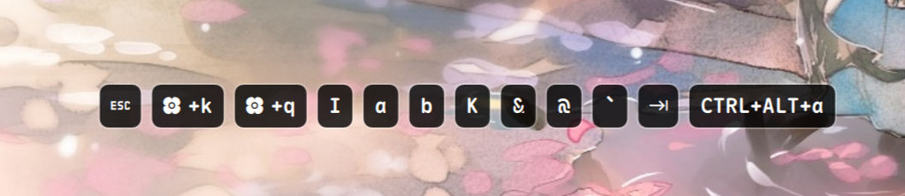

# Show Keys

A floating OSD plugin for Noctalia Shell that displays keyboard input in real-time via `evtest`.



## Features

* **Real-Time Capture**: Reads raw keyboard input events directly from your device for instantaneous tracking.
* **Multi-Monitor OSD**: Select exactly which monitors display the overlay with zero memory overhead for disabled screens.
* **Visual Customization**: Dynamically override Noctalia's native theme colors (`mPrimary`/`mSurface`) with custom text and background colors for the key pills.
* **Flexible Placement**: Anchor the display to the top or bottom edge of your monitor and fine-tune the margin distance.
* **Smart Auto-Hide**: The OSD fades out gracefully after a custom amount of idle time.
* **Quick Toggle**: Turn the capture process on or off instantly using shell IPC commands.

## Prerequisites

This plugin relies on `evtest` to read hardware input directly. That means it needs access to `/dev/input/event*`, which comes with an explicit security tradeoff.

### Security Notice

Granting your user access to the `input` group weakens Wayland's input confidentiality model. Once your user can read raw input devices directly, any process running as that user may also be able to observe keyboard input outside the compositor's usual security boundaries.

Use this plugin only if you understand and accept that tradeoff. If you are not comfortable granting `input` access, do not enable this plugin until a compositor-native or otherwise safer input API exists.

1.  **Install evtest** (for Arch Linux):
    ```bash
    sudo pacman -S evtest
    ```

2.  **Grant input group permissions**:
    Add your user to the `input` group so the plugin can read inputs without requiring root access:
    ```bash
    sudo usermod -aG input $USER
    ```
    *(Warning: this is convenient, but it also grants raw input device access to processes running as your user.)*
    *(Note: You must log out and log back in, or reboot, for this group change to take effect.)*

3.  **Find your keyboard device path**:
    Run the following command to list all input devices:
    ```bash
    sudo evtest
    ```
    Identify your primary keyboard from the list and note its event path (e.g., `/dev/input/event3`).

## Configuration & Usage

1.  Open your Noctalia Shell settings and navigate to the **Show Keys** plugin.
2.  Enter your keyboard's device path in the **Device Path** setting.
3.  Restart `noctalia-shell` to apply the changes and start the capture process.

### Keybinding / IPC Command

You can toggle the OSD visibility and capture state using Noctalia's IPC handler. Bind the following command to a custom shortcut in your Wayland compositor (e.g., `niri`) to easily show or hide the overlay:

```bash
qs -c noctalia-shell ipc call plugin:show-keys toggle
```

## License

MIT
